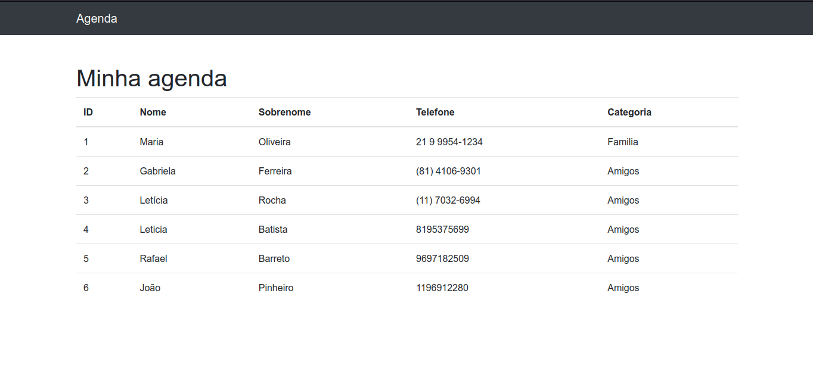

# Agenda em Django

Um sistema de Agenda de Telefone que guarde as informações dos contatos dos usuários. 

| :placard: Vitrine.Dev |     |
| -------------  | --- |
| :sparkles: Nome        | **Agenda de Telefone em Django**
| :label: Tecnologias | python, djnago, html, css (tecnologias utilizadas)

<!-- Inserir imagem com a #vitrinedev ao final do link -->

<!--  -->

## Detalhes do projeto
<!-- Imagem do Projeto  -->
<!-- Textos e imagens que descrevam seu projeto, suas conquistas, seus desafios, próximos passos, etc... -->
* 
No primeiro modulo começamos criando o projeto e o organizando de acordo com os padrões de convenção do Django.
    Foram Incluídas <i>partials</i> para melhor entendimento do projeto.

 